# SubastaYa - mapa visual del proyecto

Documento de contexto para personas y asistentes de IA. El inventario excluye artefactos generados como `bin/`, `obj/`, `node_modules/` y `dist/`.

## 1. Arbol de carpetas y archivos

```text
SubastaYa/
├── .gitignore
├── README.md
├── Practica Subasta.txt
├── Practica Subasta.pdf
├── ARQUITECTURA_PROYECTO.md
├── backend/
│   ├── SubastaYa.sln
│   └── src/
│       ├── SubastaYa.Api/
│       │   ├── SubastaYa.Api.csproj
│       │   ├── SubastaYa.Api.http
│       │   ├── Program.cs
│       │   ├── appsettings.json
│       │   ├── appsettings.Development.json
│       │   ├── Controllers/
│       │   │   ├── AuthController.cs
│       │   │   ├── CategoriasController.cs
│       │   │   └── SubastasController.cs
│       │   ├── ExceptionHandling/
│       │   │   └── GlobalExceptionHandler.cs
│       │   └── Properties/
│       │       └── launchSettings.json
│       ├── SubastaYa.Application/
│       │   ├── SubastaYa.Application.csproj
│       │   ├── Interfaces/
│       │   │   ├── IJwtService.cs
│       │   │   └── IPasswordHasher.cs
│       │   ├── Common/
│       │   │   └── Exceptions/
│       │   │       ├── CuentaNoDisponibleException.cs
│       │   │       ├── CredencialesInvalidasException.cs
│       │   │       ├── RecursoDuplicadoException.cs
│       │   │       └── RecursoNoEncontradoException.cs
│       │   └── UseCases/
│       │       ├── Autenticacion/
│       │       │   └── Login/
│       │       │       ├── LoginRequest.cs
│       │       │       ├── LoginResponse.cs
│       │       │       └── LoginUseCase.cs
│       │       ├── Categorias/
│       │       │   ├── ListarCategoriasResponse.cs
│       │       │   └── ListarCategoriasUseCase.cs
│       │       └── Subastas/
│       │           ├── ListarSubastas/
│       │           │   ├── ListarSubastasRequest.cs
│       │           │   ├── ListarSubastasResponse.cs
│       │           │   └── ListarSubastasUseCase.cs
│       │           └── ObtenerSubasta/
│       │               ├── ObtenerSubastaResponse.cs
│       │               └── ObtenerSubastaUseCase.cs
│       ├── SubastaYa.Domain/
│       │   ├── SubastaYa.Domain.csproj
│       │   ├── Entidades/
│       │   │   ├── Billetera.cs
│       │   │   ├── Categoria.cs
│       │   │   ├── MovimientoBilletera.cs
│       │   │   ├── Puja.cs
│       │   │   ├── RegistroAuditoria.cs
│       │   │   ├── Subasta.cs
│       │   │   ├── Usuario.cs
│       │   │   └── Venta.cs
│       │   └── Interfaces/
│       │       ├── ICategoriaRepository.cs
│       │       ├── ISubastaRepository.cs
│       │       └── IUsuarioRepository.cs
│       └── SubastaYa.Infrastructure/
│           ├── SubastaYa.Infrastructure.csproj
│           ├── InyeccionDependencias.cs
│           ├── Identidad/
│           │   ├── JwtService.cs
│           │   └── PasswordHasher.cs
│           ├── Persistencia/
│           │   ├── DbInitializer.cs
│           │   ├── SubastaYaDbContext.cs
│           │   ├── Configuraciones/
│           │   │   ├── BilleteraConfiguracion.cs
│           │   │   ├── CategoriaConfiguracion.cs
│           │   │   ├── MovimientoBilleteraConfiguracion.cs
│           │   │   ├── PujaConfiguracion.cs
│           │   │   ├── RegistroAuditoriaConfiguracion.cs
│           │   │   ├── SubastaConfiguracion.cs
│           │   │   ├── UsuarioConfiguracion.cs
│           │   │   └── VentaConfiguracion.cs
│           │   ├── Repositories/
│           │   │   ├── CategoriaRepository.cs
│           │   │   ├── SubastaRepository.cs
│           │   │   └── UsuarioRepository.cs
│           │   └── Migrations/
│           │       ├── 20260912144218_Inicial.cs
│           │       ├── 20260912144218_Inicial.Designer.cs
│           │       └── SubastaYaDbContextModelSnapshot.cs
│           └── (bin/ y obj/ omitidos)
├── frontend/
│   ├── .gitignore
│   ├── package.json
│   ├── package-lock.json
│   ├── index.html
│   ├── vite.config.ts
│   ├── eslint.config.js
│   ├── tsconfig.json
│   ├── tsconfig.app.json
│   ├── tsconfig.node.json
│   ├── README.md
│   ├── public/
│   │   ├── favicon.svg
│   │   └── icons.svg
│   └── src/
│       ├── main.tsx
│       ├── App.tsx
│       ├── index.css
│       ├── components/
│       │   ├── AuctionCard.tsx
│       │   ├── AuctionDetailModal.tsx
│       │   ├── AuctionListItem.tsx
│       │   ├── CountdownTimer.tsx
│       │   ├── EmptyState.tsx
│       │   ├── FilterBar.tsx
│       │   ├── HeroBanner.tsx
│       │   ├── Navbar.tsx
│       │   └── ToastNotification.tsx
│       ├── data/
│       │   └── seedAuctions.ts
│       ├── types/
│       │   └── auction.ts
│       └── utils/
│           └── formatters.ts
```

## 2. Grafico jerarquico

```mermaid
flowchart TD
    root[SubastaYa]

    root --> backend[backend - .NET 10]
    root --> frontend[frontend - React + TypeScript + Vite]
    root --> docs[Documentacion y practica]

    docs --> readme[README.md]
    docs --> practicaTxt[Practica Subasta.txt]
    docs --> practicaPdf[Practica Subasta.pdf]
    docs --> mapa[ARQUITECTURA_PROYECTO.md]

    backend --> solution[SubastaYa.sln]
    backend --> api[SubastaYa.Api]
    backend --> application[SubastaYa.Application]
    backend --> domain[SubastaYa.Domain]
    backend --> infrastructure[SubastaYa.Infrastructure]

    api --> apiProgram[Program.cs]
    api --> apiControllers[Controllers]
    apiControllers --> authController[AuthController.cs]
    apiControllers --> categoriasController[CategoriasController.cs]
    apiControllers --> subastasController[SubastasController.cs]
    api --> apiErrors[ExceptionHandling/GlobalExceptionHandler.cs]
    api --> apiConfig[appsettings + launchSettings]

    application --> appInterfaces[Interfaces]
    appInterfaces --> jwtContract[IJwtService.cs]
    appInterfaces --> passwordContract[IPasswordHasher.cs]
    application --> appExceptions[Common/Exceptions]
    appExceptions --> exceptionFiles[Excepciones de negocio]
    application --> useCases[UseCases]
    useCases --> authUseCase[Autenticacion/Login]
    authUseCase --> loginFiles[Request + Response + UseCase]
    useCases --> categoryUseCase[Categorias/ListarCategorias]
    categoryUseCase --> categoryFiles[Response + UseCase]
    useCases --> auctionUseCases[Subastas]
    auctionUseCases --> listAuctions[ListarSubastas]
    auctionUseCases --> getAuction[ObtenerSubasta]

    domain --> entities[Entidades]
    entities --> businessEntities[Billetera, Categoria, MovimientoBilletera, Puja]
    entities --> moreEntities[RegistroAuditoria, Subasta, Usuario, Venta]
    domain --> repositoryContracts[Interfaces de repositorios]
    repositoryContracts --> repositoryInterfaces[ICategoriaRepository + ISubastaRepository + IUsuarioRepository]

    infrastructure --> identity[Identidad]
    identity --> jwtService[JwtService.cs]
    identity --> passwordHasher[PasswordHasher.cs]
    infrastructure --> persistence[Persistencia]
    persistence --> dbContext[SubastaYaDbContext.cs]
    persistence --> initializer[DbInitializer.cs]
    persistence --> repositories[Repositories]
    repositories --> repositoryImplementations[CategoriaRepository + SubastaRepository + UsuarioRepository]
    persistence --> configurations[Configuraciones EF Core]
    configurations --> entityConfigurations[Configuracion de las 8 entidades]
    persistence --> migrations[Migrations]
    migrations --> migrationFiles[Migracion Inicial + Snapshot]
    infrastructure --> dependencyInjection[InyeccionDependencias.cs]

    frontend --> entrypoints[Configuracion y entrada]
    entrypoints --> indexHtml[index.html]
    entrypoints --> mainTsx[main.tsx]
    entrypoints --> appTsx[App.tsx]
    entrypoints --> styles[index.css]
    frontend --> ui[components]
    ui --> navigation[Navbar + HeroBanner + FilterBar]
    ui --> auctionViews[AuctionCard + AuctionListItem + AuctionDetailModal]
    ui --> feedback[CountdownTimer + EmptyState + ToastNotification]
    frontend --> frontendData[data/seedAuctions.ts]
    frontend --> frontendTypes[types/auction.ts]
    frontend --> frontendUtils[utils/formatters.ts]
    frontend --> staticAssets[public/favicon.svg + public/icons.svg]
    frontend --> tooling[package.json + tsconfig + vite + eslint]

    api -->|expone HTTP y JWT| frontend
    api -->|usa| application
    api -->|registra| infrastructure
    application -->|depende de contratos| domain
    infrastructure -->|implementa y persiste| domain
    application -->|usa servicios| infrastructure

    classDef backendNode fill:#e8f1ff,stroke:#2563eb,color:#102a43
    classDef frontendNode fill:#eafaf1,stroke:#16803c,color:#123524
    classDef docNode fill:#fff7e6,stroke:#c47f00,color:#4a2c00
    classDef fileNode fill:#f7f7f7,stroke:#777,color:#222

    class backend,api,application,domain,infrastructure,apiControllers,apiErrors,apiConfig,appInterfaces,appExceptions,useCases,authUseCase,categoryUseCase,auctionUseCases,domain,entities,repositoryContracts,identity,persistence,repositories,configurations,migrations,dependencyInjection backendNode
    class frontend,entrypoints,ui,frontendData,frontendTypes,frontendUtils,staticAssets,tooling frontendNode
    class docs,readme,practicaTxt,practicaPdf,mapa docNode
    class root,solution,apiProgram,authController,categoriasController,subastasController,jwtContract,passwordContract,exceptionFiles,loginFiles,categoryFiles,listAuctions,getAuction,businessEntities,moreEntities,repositoryInterfaces,jwtService,passwordHasher,dbContext,initializer,repositoryImplementations,entityConfigurations,migrationFiles,indexHtml,mainTsx,appTsx,styles,navigation,auctionViews,feedback,frontendData,frontendTypes,frontendUtils,staticAssets,tooling fileNode
```



## 3. Lectura rapida para una IA

- **Backend:** solucion .NET 10 con una arquitectura por capas.
- **Api:** punto de entrada HTTP; configura autenticacion JWT, autorizacion, CORS, OpenAPI, manejo global de excepciones y controladores.
- **Application:** contiene casos de uso, requests/responses, contratos de servicios y excepciones de aplicacion.
- **Domain:** contiene las entidades del negocio y las interfaces de repositorio; es la capa mas independiente.
- **Infrastructure:** implementa persistencia con Entity Framework Core y PostgreSQL, repositorios, migraciones, inicializacion de datos, hashing de contrasenas y JWT.
- **Frontend:** aplicacion React 19 con TypeScript y Vite. Actualmente incluye datos semilla en `src/data/seedAuctions.ts` y componentes visuales de subastas.
- **Flujo principal:** `Frontend -> Api/Controllers -> Application/UseCases -> Domain` y `Infrastructure` implementa los contratos para acceder a datos y servicios externos.
- **Modulos funcionales visibles:** autenticacion, categorias, listado de subastas y detalle de subasta.
- **Persistencia:** `SubastaYaDbContext`, configuraciones por entidad, repositorios y migracion inicial.

## 4. Convenciones para mantener este mapa

Al agregar una carpeta o archivo de codigo, actualizar primero el arbol de la seccion 1 y luego el nodo correspondiente de la seccion 2. Mantener fuera del mapa los directorios generados por compilacion o instalacion de dependencias.
